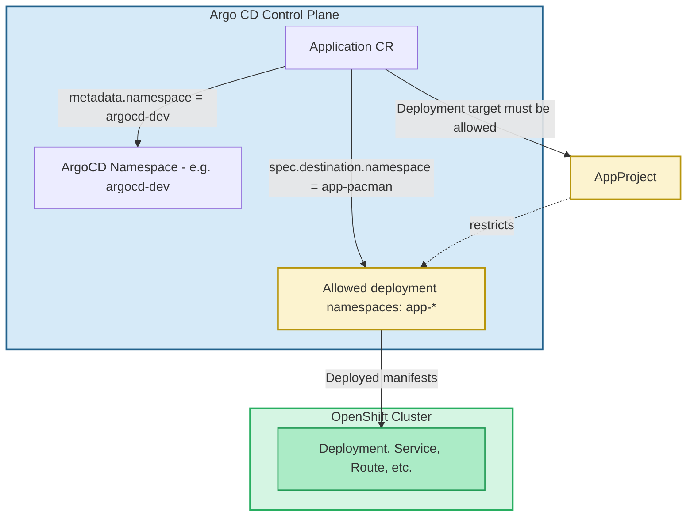

# Application Deployment Example

This repository demonstrates a possible Git repository structure for application deployments on OpenShift.

> ⚠️ In practice, the recommended approach is to have **one repository per application**.

Here, multiple example applications (`app1/`, `app2/`, `app3/`) are included in a single repo for **visibility** and to **showcase multiple setups** in one place.

Each application contains:
- Source code (`src/`)
- Dockerfile
- OpenShift manifests (`deploy/`) with Kustomize overlays
- Argo CD application definition (`argocd/`)

I'd recommend creating a **template repository** based on one of these applications. This template can then be used by teams when initializing new app-specific repositories. Also for more advanced setups, source code should be moved to a separate repository all together.

## AppProjects and Deployments

The Argo CD Application object lives in the Argo CD namespace, for example **argocd-dev**.

The actual K8s resources (Deployment, Service, Route, etc.) are deployed into the target namespace, in this case, app-pacman.

The AppProject limits which namespaces Argo CD can deploy to.
Here a pattern like **app-*** is used. This restricts deployments to namespaces outside of this pattern.